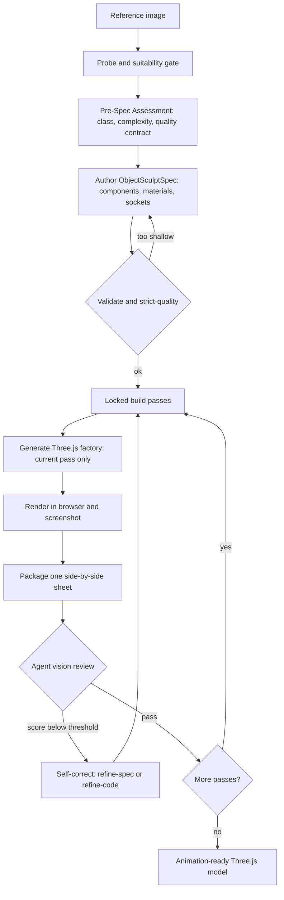

<p align="center">
  <a href="./README.md">English</a> · <a href="./README.zh-CN.md">简体中文</a> · <strong>日本語</strong>
</p>

<div align="center">


# img2threejs

**参照画像内のオブジェクトを、コードのみで構成されたプロシージャルな Three.js モデルとして再構築します。**

品質ゲートを備え、アニメーションに対応し、意図的にトークン効率を最適化しています。フォトグラメトリ、メッシュ抽出、ダウンロードしたアートパックではなく、コードによる再構築です。

[](LICENSE)
[](SKILL.md)
[](CONTRIBUTING.md)
[](https://threejs.org)
[](scripts)

<a href="https://trendshift.io/repositories/83608?utm_source=trendshift-badge&amp;utm_medium=badge&amp;utm_campaign=badge-trendshift-83608" target="_blank" rel="noopener noreferrer"></a>


</div>

*1 枚の参照画像をコードで再構築し、正しい比率、色、ベベル、金色の縁取り、発光するエンブレムを備えた状態でブラウザー内で動作させます。*

### [→ ライブデモギャラリーを開く](https://hoainho.github.io/img2threejs-showcase/)

ギャラリー内のすべてのモデルは、ブラウザーで実行される生成コードです。メッシュファイルもダウンロードも使用しません。

---

## ライブデモ

プリミティブ、プロシージャルシェーダー、生成ジオメトリだけで構築された再構築モデルです。以下のクリップはブラウザー内で動作するライブモデルです。各モデルを開くと周囲を回転して確認し、生成されたソースを読めます。

| デモ | プレビュー | 対象 | 表示 | ソース |
| --- | --- | --- | --- | --- |
| Sony WF-1000XM3 イヤホンとケース |  | ハードサーフェスオブジェクト | [ライブ](https://hoainho.github.io/img2threejs-showcase/#/demo/sony-wf1000xm3) | [コード](https://github.com/hoainho/img2threejs-showcase/blob/main/src/demos/sony-wf1000xm3/createSonyWf1000xm3Model.ts) |
| ISSACA 12 ゲージショットガン |  | ハードサーフェスオブジェクト | [ライブ](https://hoainho.github.io/img2threejs-showcase/#/demo/issaca-shotgun) | [コード](https://github.com/hoainho/img2threejs-showcase/blob/main/src/demos/issaca-shotgun/createIssacaShotgunModel.ts) |
| Gerber パラコードナイフ |  | ハードサーフェスオブジェクト | [ライブ](https://hoainho.github.io/img2threejs-showcase/#/demo/gerber-knife) | [コード](https://github.com/hoainho/img2threejs-showcase/blob/main/src/demos/gerber-knife/createGerberKnifeModel.ts) |
| ドラえもんの家（アイソメトリックジオラマ） |  | ハードサーフェスオブジェクト | [ライブ](https://hoainho.github.io/img2threejs-showcase/#/demo/doraemon-house) | [コード](https://github.com/hoainho/img2threejs-showcase/blob/main/src/demos/doraemon-house/createDoraemonHouseModel.ts) |
| War-Hauler「SECTOR 07」 |  | ハードサーフェスオブジェクト | [ライブ](https://hoainho.github.io/img2threejs-showcase/#/demo/warhauler) | [コード](https://github.com/hoainho/img2threejs-showcase/blob/main/src/demos/warhauler/createWarHaulerModel.ts) |
| 王冠付き戦利品の宝箱 |  | ハードサーフェスオブジェクト | [ライブ](https://hoainho.github.io/img2threejs-showcase/#/demo/crown-chest) | [コード](https://github.com/hoainho/img2threejs-showcase/blob/main/src/demos/crown-chest/createCrownChestModel.ts) |

ギャラリーのソースは [hoainho/img2threejs-showcase](https://github.com/hoainho/img2threejs-showcase) にあります。このプロジェクトが役立った場合は、このリポジトリに Star を付けることで他の人が見つけやすくなります。

---

## 機能

オブジェクトの参照画像を 1 枚渡すと、プリミティブ、プロシージャルシェーダー、生成ジオメトリからそのオブジェクトを再現する TypeScript 製の `THREE.Group` ファクトリを生成します。ランタイム階層（ピボット、ソケット、コライダー）を備えているため、結果は静的な塊ではなく、そのままアニメーションに利用できます。

Claude Code、Codex、OpenCode 上で動作し、特定のエージェントには依存しません。ドキュメントで「エージェントビジョン」または「エージェントブラウザーツール」と記載されている箇所では、ネイティブ画像読み取り、ブラウザー MCP、プロジェクトプレビュー、ユーザー提供のスクリーンショットなど、ホストが提供する機能を使用します。

### 対象と細部の精度

- **オブジェクトとキャラクター。** 各対象は `object`、`character`、`hybrid` のいずれかに分類されます。オブジェクトはハードサーフェスパイプラインを使用し、キャラクターは `grimoire/character/reconstruction.md` に記載された解剖学を考慮する経路（頭身、顔のランドマーク、ポーズ）を使用します。
- **細部優先の分析。** コード生成前に、アイデンティティを決める細部（光沢、ベベルや丸み、ネジやリベット、彫刻または塗装された線、輪郭、汚れ、摩耗）の `detailInventory` を列挙します。すべての細部は実在するコンポーネントまたはマテリアル項目に対応する必要があり、厳格品質ゲートはインベントリが完成するまで生成を停止します。分類法は `grimoire/intake/detail_inventory.md` にあります。
- **特定の人物やキャラクターを最大限に再現。** オプトインの投影優先経路は、パラメトリックテンプレートを画像ランドマークに合わせ、写真の照明を除去し、レンダリングカメラを一致させ、参照画像をメッシュへ投影します。1 枚の画像で 100% の類似性を保証することはできないため、パイプラインは領域ごとの信頼度を報告し、重要な場合は追加の視点を求めます。詳細は `grimoire/character/likeness_maximization.md` を参照してください。

---

## 仕組み

このスキルは段階的なスカルプトパイプラインを実行します。スクリプトが各段階をゲートし、パスを承認できるのはエージェントのビジョンだけです。



### ビルドパス

モデルは決められた順序でスカルプトされ、前のパスがレビューされ承認された後にのみ次のパスが解放されます。

`blockout → structural-pass → form-refinement → material-pass → surface-pass → lighting-pass → interaction-pass → optimization-pass`

各パスには独自の合格基準があります。実際のレンダリング、比較シート、しきい値以上のエージェントビジョンスコアがあり、アイデンティティを決める各特徴もそれぞれのしきい値以上である場合にのみ、パスは `continue` としてマークされます。

### ゲート

- **適合性**——画像が 3D の対象として実現可能かどうか。
- **事前仕様と厳格品質**——仕様がオブジェクトの複雑さに対して十分な深さになるまでコード生成を停止します（複合オブジェクトに単一ルート仕様は使用できません）。
- **スクリーンショットのフィードバック**——`continue` にはレンダリング、比較シート、合格したビジョンスコアが必要です。
- **アクション対応**——モデルは `root.userData.sculptRuntime` を通じてランタイム階層（ピボット、ソケット、コライダー、破壊グループ）を公開します。
- **接続の正確性**——子パーツ（ハンドル、手足、チューブ）は親への接続方法を宣言するため、空中に浮くことがありません。
- **マテリアルと照明のリアリズム**——独立した PBR チャンネルと実際のライトを使用し、アルベドをラフネスとして流用しません。

### 自己修正

各パスの後、エージェントは `continue`、`refine-spec`、`refine-code`、`request-input`、`stop` の中から正確に 1 つを選択します。`refine-spec` は誤っている、または浅い仕様を修正して再検証し、`refine-code` は正しい仕様と一致しないジオメトリ、マテリアル、照明を修正します。

---

## クイックスタート

1. **インストール**——このフォルダーをスキルディレクトリに配置します。

   ```bash
   git clone https://github.com/hoainho/img2threejs.git ~/.claude/skills/img2threejs
   ```

2. **呼び出し**——Claude Code でオブジェクト画像を添付または指定し、次を実行します。

   ```
   /img2threejs Rebuild this object as a Three.js model, keep the proportions, angles, and colours.
   ```

3. **パイプラインに従う**——スキルは画像を検証し、評価と仕様を作成し、ファクトリをパスごとに生成します。レンダリングが一致するまで、各段階で横並びの比較を表示します。

スクリプトはスキルのルートから実行し、必要なのは Python 3.10+ だけです。追加インストールは不要です。

```bash
python3 forge/stage1_intake/probe_image.py <image>
python3 forge/stage2_spec/new_pre_spec_assessment.py "Name" --image <image> --out assessment.json
python3 forge/stage2_spec/new_sculpt_spec.py "Name" --image <image> --assessment assessment.json --out spec.json
python3 forge/stage2_spec/validate_sculpt_spec.py spec.json --strict-quality
python3 forge/stage3_build/generate_threejs_factory.py spec.json --out src/createObjectModel.ts
```

---

## トークン効率が高い理由

多くの画像から 3D を生成するエージェントループは、パスごとにモデル全体を読み直す、ピクセルを採点する、JSON を手作業で検証する、完了済みの手順を再実行するなど、機械的な作業をモデルに行わせてトークンを消費します。img2threejs はこれらをすべて決定論的なスクリプトへ移し、実際に判断が必要な場面だけでモデルトークンを使用します。

- **スクリプトが強制し、モデルが判断。** Python スクリプトが検証、ゲート、仕様作成、PBR 抽出、比較シートのパッケージ化、パイプライン状態を処理しますが、視覚的な採点はしません。モデルのトークンは、横並びの 1 枚のシートを見て合否を判断することだけに使われます。
- **依存関係ゼロ、インストールの手間ゼロ。** すべてのスクリプトは純粋な Python 3.10+ 標準ライブラリです。pip、PIL、numpy、Playwright は不要です。PNG の読み書きには `struct` と `zlib` を使用します。インストール不要なので、コンテキスト内でデバッグするものもありません。
- **パスでゲートされた生成。** コードジェネレーターは、現在解放されているビルドパスだけを出力します。モデルが反復ごとにモデル全体を再生成または再読込する必要はなく、各手順は小さく限定されています。
- **コード生成前に早期失敗。** 厳格品質ゲートは、Three.js のコードを 1 行も生成する前に浅い仕様を停止するため、最初から仕様不足のモデルをレンダリングしてトークンを消費することがありません。
- **レビューごとに 1 枚の画像。** 各パスは、散在する複数のスクリーンショットではなく、参照画像とレンダリングを並べた 1 枚の比較シートだけで判断されます。
- **バイナリではなくテキスト出力。** 結果は差分を確認できる TypeScript と JSON 仕様です。数 MB のメッシュファイルではなく、小さくレビュー可能で、バージョン管理できます。

最終的には、画像から忠実な 3D モデルを取得しつつ、高価なモデルコンテキストを記録作業ではなく視覚的な判断とコードに割り当てられます。段階別およびサイクル別の完全なトークン内訳は [docs/TOKEN_COST.md](docs/TOKEN_COST.md) を参照してください。

---

## スクリプト

| スクリプト | 役割 |
| --- | --- |
| `stage1_intake/probe_image.py` | 画像メタデータと明らかな技術的問題（視覚チェックではありません）。 |
| `stage2_spec/new_pre_spec_assessment.py` | オブジェクトを分類し、複雑さを採点して品質契約を出力します。 |
| `stage2_spec/new_sculpt_spec.py` | 評価から ObjectSculptSpec を作成します。 |
| `stage2_spec/validate_sculpt_spec.py` | 仕様を検証し、`--strict-quality` がコード生成前に浅い仕様を停止します。 |
| `stage1_intake/extract_pbr_evidence.py` | クロップごとに参照画像由来の PBR 証拠を生成します（推論であり、逆レンダリングではありません）。 |
| `stage3_build/orchestrate_passes.py` | ロックされたパスの状態：ステータス、チェック、同期。 |
| `stage3_build/generate_threejs_factory.py` | 現在解放されているパス用の Three.js `Group` ファクトリを出力します。 |
| `stage4_review/make_comparison_sheet.py` | レビュー用に参照画像とレンダリングを並べた 1 枚のシートをパッケージ化します。 |
| `stage4_review/append_review.py` | パスごとのレビュー（スコア、判断、証拠）を記録します。 |
| `_shared/feature_acceptance_policy.py` | 特徴ごとのスコアしきい値を適用する内部ヘルパーです。 |
| `stage1_intake/build_detail_inventory.py` | 参照画像をゾーンに分割し、詳細インベントリの雛形を作成します。 |
| `stage1_intake/extract_landmarks.py` | ランドマークグリッドを重ね、キャラクター用の解剖ブロックの雛形を作成します。 |
| `stage1_intake/solve_camera_pose.py` | レンダリングのカメラを一致させるため、参照カメラブロックを出力します。 |
| `stage1_intake/delight_albedo.py` | テクスチャ投影前に写真から中立的なアルベドを近似します。 |
| `stage3_build/bake_projected_texture.py` | 写真テクスチャ投影用の投影または UV ベイク記述子を出力します。 |

`grimoire/` フォルダーには、各ゲートが適用する詳細な基準（検証、事前仕様評価、プロシージャルパターン、マテリアルと照明のリアリズム、接続の正確性、アクション対応モデル、自己修正）が含まれます。

---

## 得られるもの

- `ObjectSculptSpec` JSON：コンポーネントツリー全体、マテリアル、反復システム、ソケット、各パスで記録されたレビュー履歴。
- TypeScript の `createObjectNameModel(spec, options)` ファクトリは `THREE.Group` を返し、`root.userData.sculptRuntime` がノード、ソケット、コライダー、破壊グループを公開します。
- 各パスの忠実度を記録するレンダリングと比較シート。

---

## ロードマップ

- **v1.0**——オブジェクトパイプライン：段階的なスカルプト、レンダリングと参照画像のレビューループ、アクション対応階層。*リリース済み。*
- **v1.1**——細部優先の分析：必須の詳細インベントリ、厳格品質ゲート。*リリース済み。*
- **v1.2**——人型キャラクタージェネレーター：解剖トラック、比率ロック、特徴配置パス。*リリース済み。*
- **v1.3**——類似性の最大化：投影優先のキャラクターレンダリング、領域ごとの信頼度。*計画中。*
- **v1.4**——アニメーション対応リグ：SkinnedMesh、モーフターゲット、glTF エクスポート。*計画中。*

詳細と今後のマイルストーンは [ROADMAP.md](ROADMAP.md)、技術仕様は [docs/UPGRADE_PLAN.md](docs/UPGRADE_PLAN.md) を参照してください。

---

## 制限について

1 枚の画像から隠れた側面を把握したり、正確なジオメトリを保証したりすることはできません。このスキルは出力が近似、スタイル化、ローポリである場合に明示し、確信があるように装うのではなく、見えている面を反転して見えない面を推測します。ハードサーフェスオブジェクトには強い一方、キャラクターはフォトリアルな類似ではなく、スタイル化された再構築になります。「この画像から要求された忠実度には到達できない」という結果も有効であり、想定されています。

---

## Star の履歴

img2threejs が役立った場合は、Star を付けることで他の人が見つけやすくなります。

<a href="https://star-history.com/#hoainho/img2threejs&Date">
  <picture>
    <source media="(prefers-color-scheme: dark)" srcset="https://api.star-history.com/svg?repos=hoainho/img2threejs&type=Date&theme=dark" />
    <source media="(prefers-color-scheme: light)" srcset="https://api.star-history.com/svg?repos=hoainho/img2threejs&type=Date" />
    
  </picture>
</a>

---

## コントリビューション

コントリビューションを歓迎します。特に、プロシージャルマテリアルのレシピ、新しいゲート、ホスト対応、デモを募集しています。プロジェクトの今後については [CONTRIBUTING.md](CONTRIBUTING.md) と[ロードマップ](ROADMAP.md)を参照してください。

## ライセンス

MIT。詳しくは [LICENSE](LICENSE) を参照してください。
