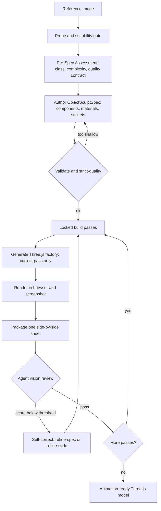

<p align="center">
  <a href="./README.md">English</a> · <strong>简体中文</strong> · <a href="./README.ja.md">日本語</a>
</p>

<div align="center">


# img2threejs

**将参考图中的物体重建为完全由代码生成的程序化 Three.js 模型。**

通过质量门控、支持动画，并且刻意优化令牌效率——这是代码重建，而不是摄影测量、网格提取或下载美术资源包。

[](LICENSE)
[](SKILL.md)
[](CONTRIBUTING.md)
[](https://threejs.org)
[](scripts)

<a href="https://trendshift.io/repositories/83608?utm_source=trendshift-badge&amp;utm_medium=badge&amp;utm_campaign=badge-trendshift-83608" target="_blank" rel="noopener noreferrer"></a>


</div>

*使用代码重建一张参考图——比例、颜色、倒角、金色饰边和发光徽章均正确——并在浏览器中实时运行。*

### [→ 打开在线演示库](https://hoainho.github.io/img2threejs-showcase/)

演示库中的每个模型都是在浏览器中运行的生成代码，不使用网格文件，也无需下载。

---

## 在线演示

这些重建完全由基础几何体、程序化着色器和生成几何体构成。以下片段是在浏览器中运行的实时模型——打开任意模型即可环绕查看并阅读生成的源代码。

| 演示 | 预览 | 对象 | 查看 | 源码 |
| --- | --- | --- | --- | --- |
| Sony WF-1000XM3 耳机和充电盒 |  | 硬表面物体 | [在线](https://hoainho.github.io/img2threejs-showcase/#/demo/sony-wf1000xm3) | [代码](https://github.com/hoainho/img2threejs-showcase/blob/main/src/demos/sony-wf1000xm3/createSonyWf1000xm3Model.ts) |
| ISSACA 12 号霰弹枪 |  | 硬表面物体 | [在线](https://hoainho.github.io/img2threejs-showcase/#/demo/issaca-shotgun) | [代码](https://github.com/hoainho/img2threejs-showcase/blob/main/src/demos/issaca-shotgun/createIssacaShotgunModel.ts) |
| Gerber 伞绳刀 |  | 硬表面物体 | [在线](https://hoainho.github.io/img2threejs-showcase/#/demo/gerber-knife) | [代码](https://github.com/hoainho/img2threejs-showcase/blob/main/src/demos/gerber-knife/createGerberKnifeModel.ts) |
| 哆啦 A 梦小屋（等距微缩景观） |  | 硬表面物体 | [在线](https://hoainho.github.io/img2threejs-showcase/#/demo/doraemon-house) | [代码](https://github.com/hoainho/img2threejs-showcase/blob/main/src/demos/doraemon-house/createDoraemonHouseModel.ts) |
| 战争运输车“SECTOR 07” |  | 硬表面物体 | [在线](https://hoainho.github.io/img2threejs-showcase/#/demo/warhauler) | [代码](https://github.com/hoainho/img2threejs-showcase/blob/main/src/demos/warhauler/createWarHaulerModel.ts) |
| 王冠战利品宝箱 |  | 硬表面物体 | [在线](https://hoainho.github.io/img2threejs-showcase/#/demo/crown-chest) | [代码](https://github.com/hoainho/img2threejs-showcase/blob/main/src/demos/crown-chest/createCrownChestModel.ts) |

演示库源码位于 [hoainho/img2threejs-showcase](https://github.com/hoainho/img2threejs-showcase)。如果本项目对你有帮助，给仓库点一个 Star 可以让更多人发现它。

---

## 功能

你提供一张物体参考图，它会生成一个用 TypeScript 编写的 `THREE.Group` 工厂，通过基础几何体、程序化着色器和生成几何体重现该物体，并包含运行时层级结构（枢轴、插槽、碰撞体），因此结果可以直接制作动画，而不是一团静态模型。

它可以在 Claude Code、Codex 或 OpenCode 中运行，并且与具体智能体无关。文档中提到“智能体视觉”或“智能体浏览器工具”时，它会使用宿主提供的能力——原生图像读取、浏览器 MCP、项目预览或用户提供的截图。

### 对象与细节精度

- **物体与角色。** 每个对象会被分类为 `object`、`character` 或 `hybrid`。物体使用硬表面流程；角色则进入 `grimoire/character/reconstruction.md` 中记录的解剖感知流程（头部单位比例、面部标志点和姿势）。
- **细节优先分析。** 在生成代码之前，流程会列出由身份定义型微小细节组成的 `detailInventory`（光泽、倒角或圆角、螺钉或铆钉、雕刻或绘制线条、轮廓、污渍和磨损）。每个细节必须映射到真实组件或材质条目，严格质量门控会阻止生成，直到清单完整。分类法位于 `grimoire/intake/detail_inventory.md`。
- **最大程度还原特定人物或角色。** 可选的投影优先流程会将参数化模板拟合到图像标志点，对照片去光照、匹配渲染相机，并将参考图投影到网格上。单张图像无法保证 100% 相似，因此流程会报告各区域置信度，并在必要时请求更多视角。详情见 `grimoire/character/likeness_maximization.md`。

---

## 工作原理

此技能运行一个分阶段的雕刻流程。脚本对每个阶段进行门控；只有智能体的视觉能力可以批准一次构建通过。



### 构建阶段

模型按固定顺序进行雕刻；只有前一阶段经过检查并获准后，下一阶段才会解锁：

`blockout → structural-pass → form-refinement → material-pass → surface-pass → lighting-pass → interaction-pass → optimization-pass`

每个阶段都有自己的验收标准。只有具备真实渲染图、对比图、达到或超过阈值的智能体视觉评分，并且每个身份定义型特征都达到其自身阈值时，该阶段才会标记为 `continue`。

### 门控

- **适用性**——图像是否适合作为 3D 目标。
- **预规格与严格质量**——在规格深度足以匹配物体复杂度前阻止代码生成（复合物体不能使用单根规格）。
- **截图反馈**——`continue` 需要渲染图、对比图以及通过的视觉评分。
- **可执行性**——模型通过 `root.userData.sculptRuntime` 暴露运行时层级结构（枢轴、插槽、碰撞体、破坏组）。
- **连接正确性**——子部件（把手、四肢、管道）会声明其与父级的连接方式，确保不会悬浮在半空中。
- **材质与光照真实感**——使用独立的 PBR 通道和真实灯光，绝不把反照率直接复用为粗糙度。

### 自我修正

每个阶段结束后，智能体必须准确选择一个操作：`continue`、`refine-spec`、`refine-code`、`request-input` 或 `stop`。`refine-spec` 修复错误或过浅的规格并重新验证；`refine-code` 修复不符合正确规格的几何体、材质或光照。

---

## 快速开始

1. **安装**——将此文件夹放入你的技能目录：

   ```bash
   git clone https://github.com/hoainho/img2threejs.git ~/.claude/skills/img2threejs
   ```

2. **调用**——在 Claude Code 中附加或指向一张物体图像并运行：

   ```
   /img2threejs Rebuild this object as a Three.js model, keep the proportions, angles, and colours.
   ```

3. **按照流程操作**——此技能会验证图像、编写评估和规格、逐阶段生成工厂，并在每一步显示并排对比，直到渲染结果匹配。

脚本从技能根目录运行，只需要 Python 3.10+，无需安装任何其他内容。

```bash
python3 forge/stage1_intake/probe_image.py <image>
python3 forge/stage2_spec/new_pre_spec_assessment.py "Name" --image <image> --out assessment.json
python3 forge/stage2_spec/new_sculpt_spec.py "Name" --image <image> --assessment assessment.json --out spec.json
python3 forge/stage2_spec/validate_sculpt_spec.py spec.json --strict-quality
python3 forge/stage3_build/generate_threejs_factory.py spec.json --out src/createObjectModel.ts
```

---

## 为什么它节省令牌

大多数图像转 3D 智能体循环会让模型执行机械性工作而浪费令牌，例如每个阶段重新读取整个模型、对像素评分、手动验证 JSON、重新运行已经完成的步骤。img2threejs 将所有这些工作交给确定性脚本，只在真正需要判断的地方使用模型令牌。

- **脚本执行规则，模型负责判断。** Python 脚本处理验证、门控、规格编写、PBR 提取、对比图打包和流程状态，但绝不对视觉效果评分。模型令牌只用于一件事：查看一张并排对比图并判断通过或失败。
- **零依赖，零安装干扰。** 每个脚本都只使用纯 Python 3.10+ 标准库。不使用 pip、PIL、numpy 或 Playwright。PNG 读写通过 `struct` 和 `zlib` 完成。无需安装就意味着无需在上下文中调试安装问题。
- **阶段门控生成。** 代码生成器只输出当前解锁的构建阶段。模型不必在每次迭代中重新生成或读取整个模型——每一步都小而聚焦。
- **在代码生成前快速失败。** 严格质量门控会在生成任何一行 Three.js 代码前拦截过浅的规格，从而避免将令牌浪费在渲染一开始就规格不足的模型上。
- **每次检查只用一张图。** 每个阶段都只依据一张打包好的对比图（参考图与渲染图并排）进行判断，而不是分散的多张截图。
- **文本输出，而非二进制文件。** 结果是可比较差异的 TypeScript 和 JSON 规格——体积小、易于检查、可纳入版本控制，而不是数 MB 的网格文件。

最终效果是：你仍能从图像得到忠实的 3D 模型，但昂贵的模型上下文会留给视觉判断和代码，而不是记录工作。完整的各阶段与各循环令牌明细见 [docs/TOKEN_COST.md](docs/TOKEN_COST.md)。

---

## 脚本

| 脚本 | 作用 |
| --- | --- |
| `stage1_intake/probe_image.py` | 图像元数据和明显的技术问题（不进行视觉检查）。 |
| `stage2_spec/new_pre_spec_assessment.py` | 对物体分类、评估复杂度并生成质量契约。 |
| `stage2_spec/new_sculpt_spec.py` | 根据评估编写 ObjectSculptSpec。 |
| `stage2_spec/validate_sculpt_spec.py` | 验证规格；`--strict-quality` 在代码生成前拦截过浅的规格。 |
| `stage1_intake/extract_pbr_evidence.py` | 为每个裁剪区域生成源自参考图的 PBR 证据（推断，而非逆向渲染）。 |
| `stage3_build/orchestrate_passes.py` | 锁定阶段状态：状态、检查、同步。 |
| `stage3_build/generate_threejs_factory.py` | 为当前解锁阶段输出 Three.js `Group` 工厂。 |
| `stage4_review/make_comparison_sheet.py` | 打包一张参考图与渲染图的对比图以供检查。 |
| `stage4_review/append_review.py` | 记录每个阶段的检查：评分、决定和证据。 |
| `_shared/feature_acceptance_policy.py` | 强制执行各特征评分阈值的内部辅助工具。 |
| `stage1_intake/build_detail_inventory.py` | 将参考图划分为区域并搭建细节清单框架。 |
| `stage1_intake/extract_landmarks.py` | 叠加标志点网格，并为角色搭建解剖结构块。 |
| `stage1_intake/solve_camera_pose.py` | 输出参考相机块，以便渲染可以匹配相机。 |
| `stage1_intake/delight_albedo.py` | 在纹理投影前，从照片近似生成中性反照率。 |
| `stage3_build/bake_projected_texture.py` | 为照片纹理投影输出投影或 UV 烘焙描述符。 |

`grimoire/` 文件夹包含每个门控应用的详细评分准则（验证、预规格评估、程序化模式、材质和光照真实感、连接正确性、可执行模型、自我修正）。

---

## 输出内容

- 一份 `ObjectSculptSpec` JSON：完整的组件树、材质、重复系统、插槽，以及每个阶段记录的检查历史。
- 一个 TypeScript `createObjectNameModel(spec, options)` 工厂，返回 `THREE.Group`，并通过 `root.userData.sculptRuntime` 暴露节点、插槽、碰撞体和破坏组。
- 一张渲染图以及记录各阶段保真度的对比图。

---

## 路线图

- **v1.0**——物体流程：分阶段雕刻、渲染图与参考图检查循环、可执行层级结构。*已发布。*
- **v1.1**——细节优先分析：必需的细节清单、严格质量门控。*已发布。*
- **v1.2**——人形角色生成器：解剖流程、比例锁定和特征定位阶段。*已发布。*
- **v1.3**——相似度最大化：投影优先的角色渲染、各区域置信度。*计划中。*
- **v1.4**——动画就绪骨骼：SkinnedMesh、变形目标、glTF 导出。*计划中。*

完整详情和后续里程碑见 [ROADMAP.md](ROADMAP.md)。技术规格见 [docs/UPGRADE_PLAN.md](docs/UPGRADE_PLAN.md)。

---

## 坦诚说明限制

单张图像无法呈现隐藏的侧面，也无法保证几何体完全准确。此技能会明确说明输出何时为近似、风格化或低多边形，并通过镜像可见面来推断不可见面，而不是假装确定。它擅长处理硬表面物体；角色属于风格化重建，而不是照片级相似。“无法从此图像达到所要求的保真度”是有效且预期的结果。

---

## Star 历史

如果 img2threejs 对你有帮助，点一个 Star 可以让更多人发现它。

<a href="https://star-history.com/#hoainho/img2threejs&Date">
  <picture>
    <source media="(prefers-color-scheme: dark)" srcset="https://api.star-history.com/svg?repos=hoainho/img2threejs&type=Date&theme=dark" />
    <source media="(prefers-color-scheme: light)" srcset="https://api.star-history.com/svg?repos=hoainho/img2threejs&type=Date" />
    
  </picture>
</a>

---

## 参与贡献

欢迎贡献，尤其是程序化材质配方、新门控、宿主覆盖和演示。请参阅 [CONTRIBUTING.md](CONTRIBUTING.md) 和[路线图](ROADMAP.md)，了解项目的发展方向。

## 许可证

MIT。请参阅 [LICENSE](LICENSE)。
